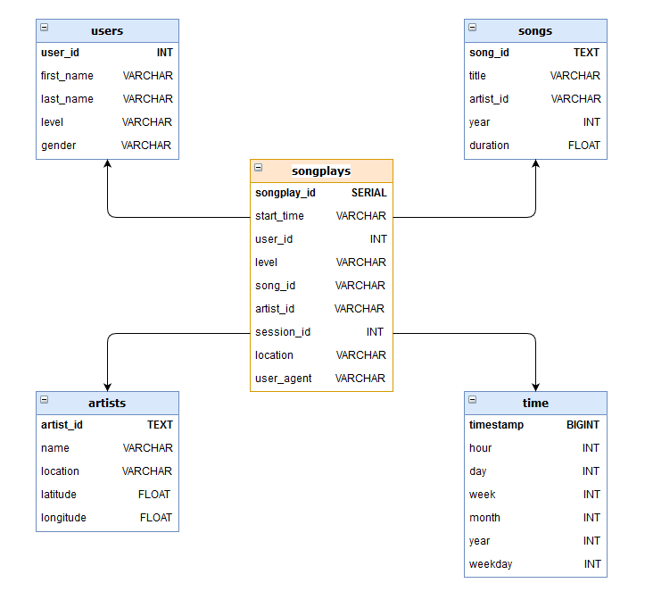

# Data Modeling with Postgres
Project #1A for Udacity's Data Engineering Nanodegree  
5th November 2019  
By Kyle McMillan

### Introduction
A startup called Sparkify wants to analyze the data they've been collecting on songs and user activity on their new music streaming app. The analytics team is particularly interested in understanding what songs users are listening to. Currently, they don't have an easy way to query their data, which resides in a directory of JSON logs on user activity on the app, as well as a directory with JSON metadata on the songs in their app.

They'd like a data engineer to create a Postgres database with tables designed to optimize queries on song play analysis, and bring you on the project. Your role is to create a database schema and ETL pipeline for this analysis. You'll be able to test your database and ETL pipeline by running queries given to you by the analytics team from Sparkify and compare your results with their expected results.

### Project Description
This is the first project in the Data Engineering Nanodegree and is based around data modeling with Postgres and building and ETL pipeline using Python. To complete the project, fact and dimension tables were created in a star schema for a focus on analytics. An ETL pipeline is used to transfer date from local directories to the postgres tables. 

### Datasets
There are two datasets used for this project. The song dataset and the log dataset.

#### The song dataset. 
This dataset is a subset of real data from the [Million Song Dataset](https://labrosa.ee.columbia.edu/millionsong/). Each file is in JSON format and contains metadata about a song and the artist of that song. The files are partitioned by the first three letters of each song's track ID. 
For example, here are filepaths to two files in this dataset.  
    `song_data/A/B/C/TRABCEI128F424C983.json`
    `song_data/A/A/B/TRAABJL12903CDCF1A.json`  
Inspecting the file TRAABJL12903CDCF1A.json, this is what the JSON data looks like:

    {
        "num_songs": 1, 
        "artist_id": "ARJIE2Y1187B994AB7", 
        "artist_latitude": null, 
        "artist_longitude": null, 
        "artist_location": "", 
        "artist_name": "Line Renaud", 
        "song_id": "SOUPIRU12A6D4FA1E1", 
        "title": "Der Kleine Dompfaff", 
        "duration": 152.92036, 
        "year": 0
    }

#### The log dataset.
The second dataset consists of log files in JSON format generated by this [event simulator](https://github.com/Interana/eventsim) based on the songs in the dataset above. These simulate activity logs from a music streaming app based on specified configurations.
The log files in the dataset are partitioned by year and month. 
For example, here are filepaths to two files in this dataset.  
    `log_data/2018/11/2018-11-12-events.json`
    `log_data/2018/11/2018-11-13-events.json`  
Inspecting the file 2018-11-13-events.json, this is a portion of what the JSON data looks like:
    {
        "artist":null,
        "auth":"Logged In",
        "firstName":"Kevin",
        "gender":"M",
        "itemInSession":0,
        "lastName":"Arellano",
        "length":null,
        "level":"free",
        "location":
        "Harrisburg-Carlisle, PA",
        "method":"GET",
        "page":"Home",
        "registration":1540006905796.0,
        "sessionId":514,
        "song":null,
        "status":200,
        "ts":1542069417796,
        "userAgent":"\"Mozilla\/5.0 (Macintosh; Intel Mac OS X 10_9_4) AppleWebKit\/537.36 (KHTML, like Gecko) Chrome\/36.0.1985.125 Safari\/537.36\"",
        "userId":"66"
    }

### Project files
This project contains seven files as well as the data files.
1. `create_tables.py` Creates and drops the tables used in this project.
2. `etl.ipynb` The project walkthrough for inserting data into the tables created by `create_tables.py` using a notebook. 
3. `etl.py` Inserts all the data into the tables created by `create_tables.py`.
4. `README.md` This file.
5. `sql_queries.py` Defines the tables to be used as well as the features of each table 
6. `test.ipynb` To test if the data was inserted correctly into the database.

### Database and Tables

#### __Fact table__
- `songplays` records in log data associated with song plays. Recorded as "NextSong" in the database.
    - songplay_id, start_time, user_id, level, song_id, artist_id, session_id, location, user_agent

#### __Dimension Tables__
- `users` The users in the database.
    - user_id, first_name, last_name, gender, level
- `songs`  The songs in the database.
    - song_id, title, artist_id, year, duration
- `artists` The song artists in the database.
    - artist_id, name, location, latitude, longitude
- `times` The timestamp records from `songplays` split into specific units.
    - start_time, hour, day, week, month, year, weekday
    
### Song Play Analysis Schema
As the data for this project is intened to be used for analysis purposes, a star schema will be used.

Visual diagram of the tables.